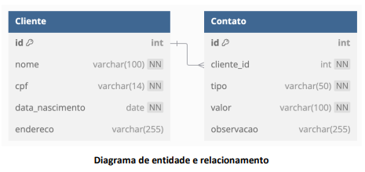

# Agenda de contatos

|       Status       | Requisito                                                                                                                                                                               |
| :----------------: | --------------------------------------------------------------------------------------------------------------------------------------------------------------------------------------- |
| :heavy_check_mark: | RF01: O sistema deve permitir o cadastro de clientes com os seguintes dados: Nome, CPF, Data de Nascimento e Endereço;                                                                  |
| :heavy_check_mark: | RF02: O sistema deve permitir a edição dos dados de um cliente cadastrado;                                                                                                              |
| :heavy_check_mark: | RF03: O sistema deve permitir a exclusão de um cliente cadastrado;                                                                                                                      |
| :heavy_check_mark: | RF04: O sistema deve permitir a listagem de todos os clientes cadastrados;                                                                                                              |
| :heavy_check_mark: | RF05: O sistema deve permitir a busca de um cliente pelo Nome ou CPF;                                                                                                                   |
| :heavy_check_mark: | RF06: O sistema deve permitir o cadastro de contatos para um cliente, contendo os seguintes dados: Tipo do Contato (Telefone, E-mail), Valor do Contato (número ou email) e Observação; |
| :heavy_check_mark: | RF07: O sistema deve permitir a edição dos contatos de um cliente;                                                                                                                      |
| :heavy_check_mark: | RF08: O sistema deve permitir a exclusão de um contato de um cliente;                                                                                                                   |
| :heavy_check_mark: | RF09: O sistema deve permitir a listagem de todos os contatos de um cliente específico.                                                                                                 |

|       Status       | Regra de negocio                                                                            |
| :----------------: | ------------------------------------------------------------------------------------------- |
| :heavy_minus_sign: | RN01: Os campos Nome e CPF são obrigatórios no cadastro do cliente;                         |
| :heavy_minus_sign: | RN02: Os campos Tipo do Contato e Valor do Contato são obrigatórios no cadastro do contato; |
| :heavy_minus_sign: | RN03: O CPF informado deve ser único no sistema;                                            |
| :heavy_minus_sign: | RN04: O Nome do cliente não pode estar vazio;                                               |
| :heavy_minus_sign: | RN05: A Data de Nascimento deve ser válida;                                                 |
| :heavy_minus_sign: | RN06: Um cliente pode ter mais de um contato cadastrado;                                    |
| :heavy_minus_sign: | RN07: Ao excluir um cliente, todos os seus contatos devem ser removidos do sistema;         |
| :heavy_minus_sign: | RN08: O sistema deve validar os dados informados antes de permitir o cadastro ou edição.    |

