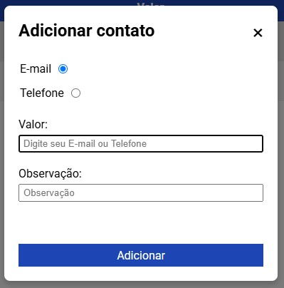
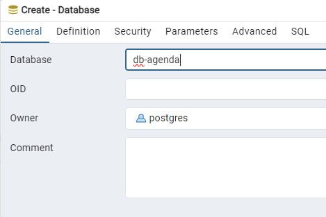
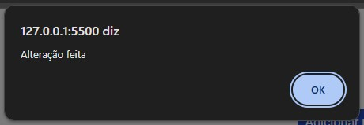
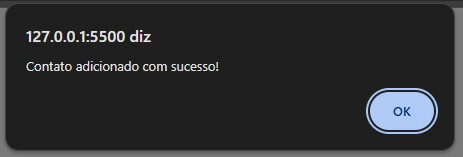

# Agenda de contatos

# Índice

1. [Requisitos](#requisitos)
2. [Estrutura do projeto](#estrutura-do-projeto)
   2.1. [Backend ou Server-side](#backend-ou-server-side)
   2.2. [Front ou Client-side](#front-ou-client-side)
   2.2.1. [Tela Cliente](#tela-cliente)
   2.2.2. [Tela Contatos](#tela-de-contatos)
   2.3. [Banco de dados](#banco-de-dados)
3. [Dependências](#dependências)
4. [Configurações](#configurações)
5. [Instruções de uso](#instruções-de-uso)

## Requisitos

|       Status       | Requisito                                                                                                                                                                               |
| :----------------: | --------------------------------------------------------------------------------------------------------------------------------------------------------------------------------------- |
| :heavy_check_mark: | RF01: O sistema deve permitir o cadastro de clientes com os seguintes dados: Nome, CPF, Data de Nascimento e Endereço;                                                                  |
| :heavy_check_mark: | RF02: O sistema deve permitir a edição dos dados de um cliente cadastrado;                                                                                                              |
| :heavy_check_mark: | RF03: O sistema deve permitir a exclusão de um cliente cadastrado;                                                                                                                      |
| :heavy_check_mark: | RF04: O sistema deve permitir a listagem de todos os clientes cadastrados;                                                                                                              |
| :heavy_check_mark: | RF05: O sistema deve permitir a busca de um cliente pelo Nome ou CPF;                                                                                                                   |
| :heavy_check_mark: | RF06: O sistema deve permitir o cadastro de contatos para um cliente, contendo os seguintes dados: Tipo do Contato (Telefone, E-mail), Valor do Contato (número ou email) e Observação; |
| :heavy_check_mark: | RF07: O sistema deve permitir a edição dos contatos de um cliente;                                                                                                                      |
| :heavy_check_mark: | RF08: O sistema deve permitir a exclusão de um contato de um cliente;                                                                                                                   |
| :heavy_check_mark: | RF09: O sistema deve permitir a listagem de todos os contatos de um cliente específico.                                                                                                 |

|       Status       | Regra de negocio                                                                            |
| :----------------: | ------------------------------------------------------------------------------------------- |
| :heavy_check_mark: | RN01: Os campos Nome e CPF são obrigatórios no cadastro do cliente;                         |
| :heavy_check_mark: | RN02: Os campos Tipo do Contato e Valor do Contato são obrigatórios no cadastro do contato; |
| :heavy_check_mark: | RN03: O CPF informado deve ser único no sistema;                                            |
| :heavy_check_mark: | RN04: O Nome do cliente não pode estar vazio;                                               |
| :heavy_check_mark: | RN05: A Data de Nascimento deve ser válida;                                                 |
| :heavy_check_mark: | RN06: Um cliente pode ter mais de um contato cadastrado;                                    |
| :heavy_check_mark: | RN07: Ao excluir um cliente, todos os seus contatos devem ser removidos do sistema;         |
| :heavy_check_mark: | RN08: O sistema deve validar os dados informados antes de permitir o cadastro ou edição.    |


## Estrutura do projeto

### Backend ou Server-side

Foi construido utlizando Java com spring-boot, com o padrão de arquitetura de camadas, sua estrutura básica consiste em:

**Config**
Diretório das configuraçãos, onde até o momento tem apenas a configuraçãos de CORS

**Controllers**
Classes que trabalham as requisições de _Clientes_ de _Contatos_

**Service**
Classes que trabalham as regras de negócios de _Clientes_ de _Contatos_, um intermediário entre a camada do banco de dados e a camada de requisições(controllers).

**Entities**
São as classes dos modelos da aplicação e que mapeam os objetos e relações no banco de dados e na aplicação.

**DTOs**
Classe baseada nas **Entities**, para trabalhar na transferencia de dados, evitando exposição e mostrando apenas os dados necessários para a aplicação.

**Repositories**
Interface que trabalha a comunicação com o banco de dados, utilizando a API JPA e o Hibernate.

### Front ou Client-side

Foi contruido utilizando HTML, CSS e Javascript sem frameworks.
A aplicação utliza de funções comuns do DOM, como _querySelector_ e _addEventListener_, para manipulação de informações da página e no CSS propriedades com _display flex_ para estilização.

#### Tela Cliente


Na tela inicial é apresentado uma lista de todos os clientes cadastrados na base de dados, trazendo as seguintes informações dos mesmos: Id, nome, CPF, data de nascimento e endereço.

Esta tela possui as seguintes funções:

-   Adicionar novo cliente
-   Pesquisar cliente por nome ou CPF
-   Editar Cliente
-   Excluir cliente
-   Ver contatos

**Modal Cadastrar cliente**

Ao clicar no botão de **Adicionar novo cliente**, será apresentado um modal com um formulário para cadastro.


Ao preencher as informações do cliente e clicar em **Cadastrar**, a página inicial será atualizada e incluirá na lista o novo cliente.

#### Tela de Contatos

Clicando no botão **Ver contatos**, somos redirecionados para a tela de contato, referente ao cliente que estava o botão.


Na tela de contatos é apresentado uma lista de todos os contatos cadastrados de um respectivo cliente, trazendo as seguintes informações dos mesmos: Id, tipo de contato, o contato e uma observação sobre o mesmo.

Esta tela possui as seguintes funções:

-   Adicionar novo contato
-   Editar contato
-   Excluir contato

#### Modal adicionar contato

Ao clicar em **Adicionar novo contato**, será mostrado o modal **Adicionar contato**, solicitando o tipo de contato com _Radios Buttons_, podendo escolher entre "E-mail" e "Telefone", tambem o valor do contato e uma observação.



Ao preencher as informações do cliente e clicar em **Adicionar**, a página mostrará um alerta, confirmado, a lista será atualizada e incluirá o novo contato.

## Banco de dados

O SGBD utilizado para o sistema de banco de dados foi o **_PostgreSQL_** e para testes foi o **_H2 Database_**.

### Modelagem dos dados

[Script para definição do banco de dados](backend/create.sql)
[Script para população das tabelas](backend/src/main/resources/import.sql)

Para gerar o script de modelagem do banco de dados, foi utlizado a API JPA do Java, por meio dos comandos inseridos em **application-dev.properties**

```bash
spring.jpa.properties.jakarta.persistence.schema-generation.create-source=metadata
spring.jpa.properties.jakarta.persistence.schema-generation.scripts.action=create
spring.jpa.properties.jakarta.persistence.schema-generation.scripts.create-target=create.sql
spring.jpa.properties.hibernate.hbm2ddl.delimiter=;
```

## Dependências

### Backend

-   Spring Web
-   Spring Data JPA
-   H2 Database (Teste)
-   PostgreSQL JDBC Driver

### Frontend

-   Sem dependências

## Configurações

**Configurando o banco de dados**

1. Criar o database **db-agenda**
   <br>
   <br>
2. Criar as tabelas **tb_clientes** e **tb_contatos**
   <br>
   <br>

**Conectando o backend ao banco de dados**

1. Adicionar os dados do banco em **application-dev.properties**

    ```bash
    # Caminho do arquivo
    backend/src/main/resources/application-dev.properties

    # Dados do banco de dados
    spring.datasource.url=jdbc:postgresql://localhost:5432/db-agenda
    spring.datasource.username=postgres
    spring.datasource.password=postgres

    # Trocar :5432 pela porta utilizada pelo seu Postgres
    # Trocar db-agenda pelo nome dado ao database do projeto
    ```

    

2. Trocar perfil ativo do Spring

    ```bash
    # Caminho do arquivo
    backend/src/main/resources/application.properties

    # ${APP_PROFILE:test} serve para testa a aplicação com o H2 Database
    # ${APP_PROFILE:dev} serve para testa a aplicação com o Postgresql
    spring.profiles.active=${APP_PROFILE:dev}
    ```

    

3. Rodando a aplicação backend

    **Utilizando o Spring Tools Suit**
    

    **Utilizando o CMD**

    ```bash
    # Diretório do projeto
    backend/src/

    # Comando para roda a aplicação
    ./mvnw spring-boot:run
    ```

## Instruções de uso

### Acessando a lista de clientes

**Basta executar o arquivo index.html**


### Cadastrar um novo cliente

Clicando em adicionar novo cliente, será solicitado as informações do mesmo, ao final do preenchimento basta clicar em "Adicionar".
<br>
<br><br>

**Confirmação de cadastro:**
<br>

### Editar informações do cliente

Ao clicar no simbolo de edição, será mostrado os dados do cliente a ser editado, após trocar a informação basta clicar em salvar.
<br>
<br>

**Resultado da edição:**
<br>
<br>

### Excluir cliente

Clicando do botão com o icone de lixeira, será realizado a exclução das informações do cliente todos os contatos relacionados ao mesmo.
<br>

**Resultado da exclusão:**
<br>
<br>

### Pesquisar por nome ou CPF

Inserindo o nome ou CPF no campo de pesquisa e clicando no icone de Lupa, o sistema listará o cliente que combina com o valor pesquisado
<br>

### Consultar contatos de um determinado cliente

Ao clicar em **Ver contatos**, o usuário será redirecionado a pagina de contatos.
<br>

<br>

### Adicionar um novo contato do cliente

Clicando em **Adicionar novo contato**, será solicitado os dados do novo contato do cliente.

<br><br>
<br>

Ao pressionar **Adicionar** aparecerá o alerta de sucesso e o novo contato será listado na página.

<br><br>
<br>

### Excluir contato

Clicando no icone de lixeira, o contato será excluido imediatamente, aparecendo um alerta indicando o sucesso da exclusão

<br><br>

<br><br>

**Resultado**:
<br>

### Editar contato do cliente

Clicando no icone de edição, será mostrado as informações do contato selecionado, basta alterar a informação que deseja e clicar em **Salvar**:

<br><br>
<br><br>
<br><br>

**Valor alterado**:
<br><br>
